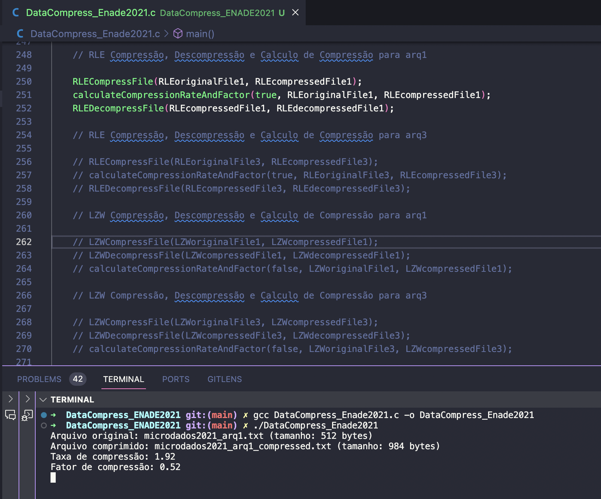
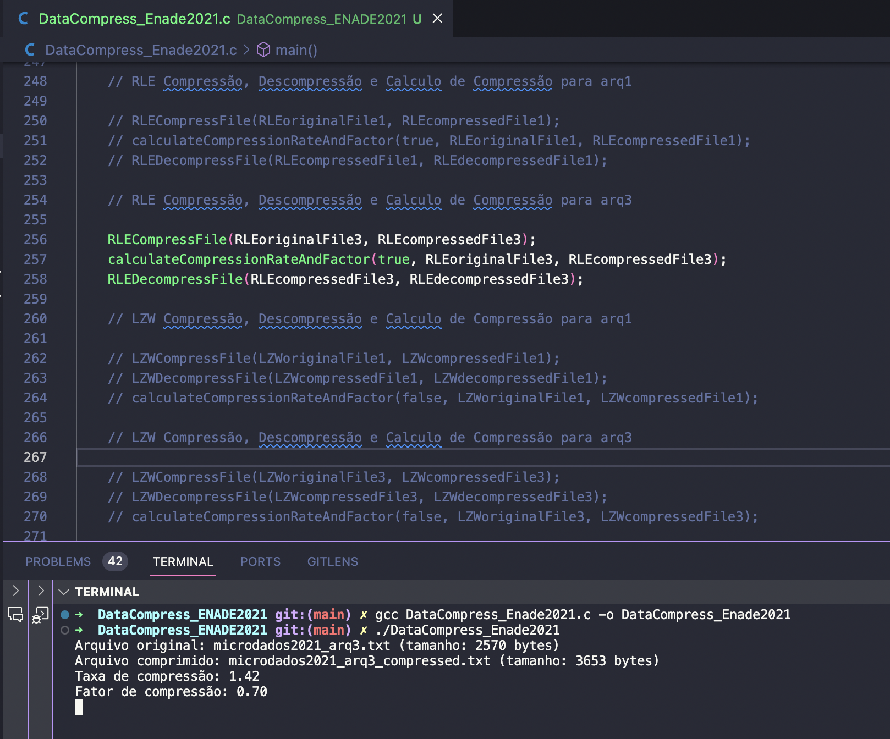
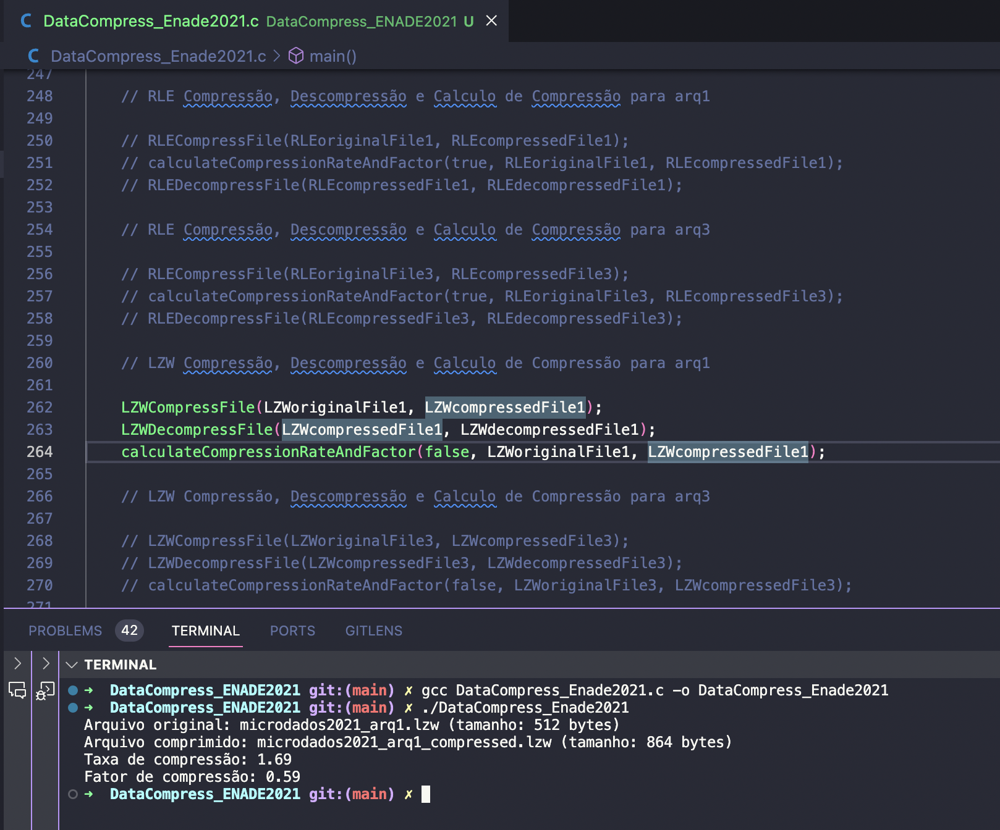
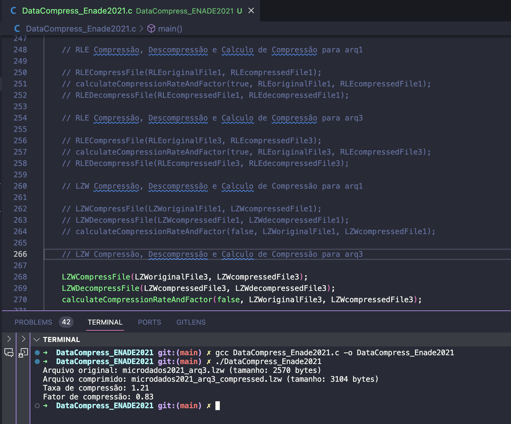

# ENADE 2021 Database Compress and Decompress with RLE & LZW (🇧🇷/🇺🇸)

## 🇧🇷 Sobre o Presente Código

Este é um programa capaz de ler os dados disponibilizados do ENADE de 2021, comprimi-los e descomprimi-los utilizando técnicas de compressão de dados como RLE e LZW.

## Dados do ENADE 2021

> Por favor, baixe os arquivos microdados2021_arq1.txt e microdados2021_arq3.txt e insira-os nesta pasta (eles são pesados demais para serem carregados ao git)

Os dados utilizados neste projeto estão disponíveis neste [link](https://www.gov.br/inep/pt-br/acesso-a-informacao/dados-abertos/microdados/enade). <b>No entanto</b>, como são arquivos extensos, sua leitura e manipulação é morosa, tendo isso em vista, o presente projeto apresenta uma versão encurtada dos arquivos utilizados -- caso queira utilizar os originais, basta substituir.

## Funcionalidades do Programa

- [x] Compressão com a técnica RLE
- [x] Descompressão com a técnica RLE
- [x] Cálculo da Taxa de Compressão com RLE
- [x] Cálculo do Fator de Compressão com RLE
- [x] Compressão com a técnica LZW
- [x] Descompressão com a técnica LZW
- [x] Cálculo da Taxa de Compressão com LZW
- [x] Cálculo do Fator de Compressão com LZW

## Como utilizar

Rodar todas as funcionalidades do programa ao mesmo tempo pode resultar em processos longos. Portanto, descomente o bloco de funcionalidade desejado toda vez que deseje que o mesmo execute.

### RLE Compressão, Descompressão e Calculo de Compressão para arq1

### RLE Compressão, Descompressão e Calculo de Compressão para arq3

### LZW Compressão, Descompressão e Calculo de Compressão para arq1

### LZW Compressão, Descompressão e Calculo de Compressão para arq3

---

## 🇺🇸 About the present code

This is a program capable of reading the ENADE 2021 data, compressing and decompressing it using data compression techniques such as RLE and LZW.

## ENADE 2021 Data

> Please download the files microdados2021_arq1.txt and microdados2021_arq3.txt and place them in this folder (they are too large to be uploaded to git).

The data used in this project is available at this [link](https://www.gov.br/inep/pt-br/acesso-a-informacao/dados-abertos/microdados/enade). However, as these are extensive files, their reading and manipulation are slow. With this in mind, the current project presents a shortened version of the files used -- if you wish to use the originals, simply replace them.

## Available Functional Requirements

- [x] Compression with RLE technique
- [x] Decompression with RLE technique
- [x] Calculation of Compression Rate with RLE
- [x] Calculation of Compression Factor with RLE
- [x] Compression with LZW technique
- [x] Decompression with LZW technique
- [x] Calculation of Compression Rate with LZW
- [x] Calculation of Compression Factor with LZW

## How to Use

Running all the program's functionalities at the same time can result in lengthy processes. Therefore, uncomment the desired functionality block every time you wish it to execute.

### RLE Compression, Decompression, and Compression Calculation for arq1

### RLE Compression, Decompression, and Compression Calculation for arq3

### LZW Compression, Decompression, and Compression Calculation for arq1

### LZW Compression, Decompression, and Compression Calculation for arq3

